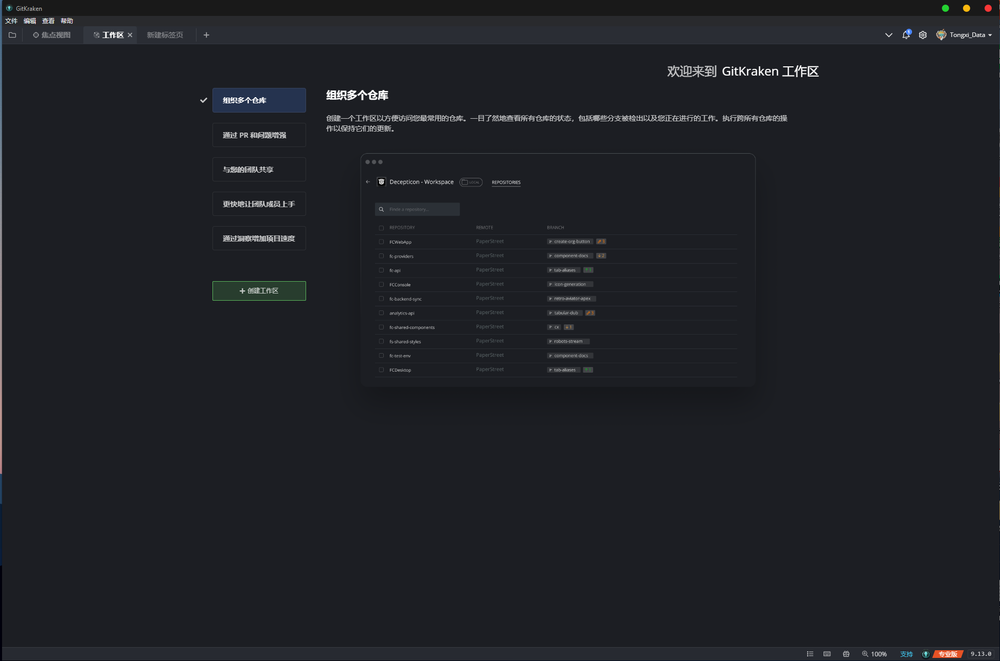
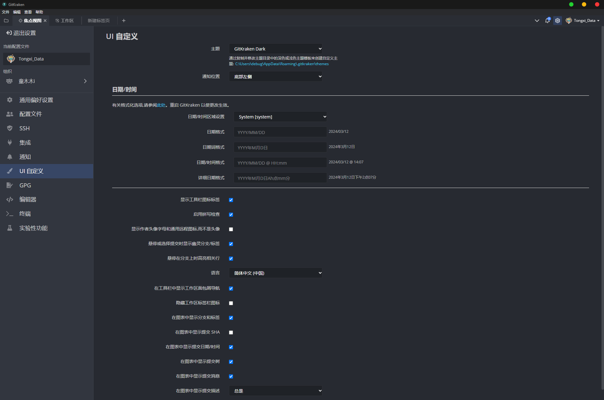
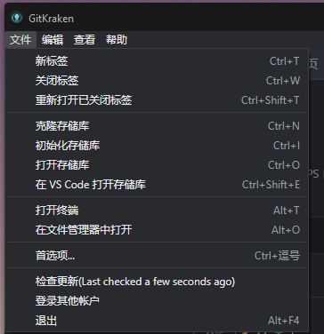
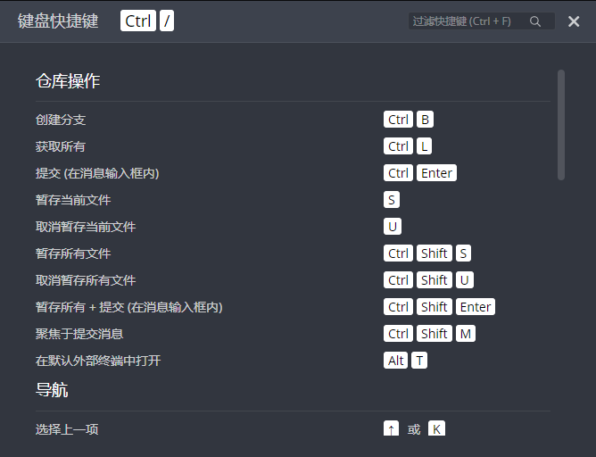
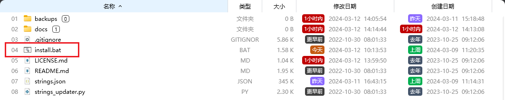
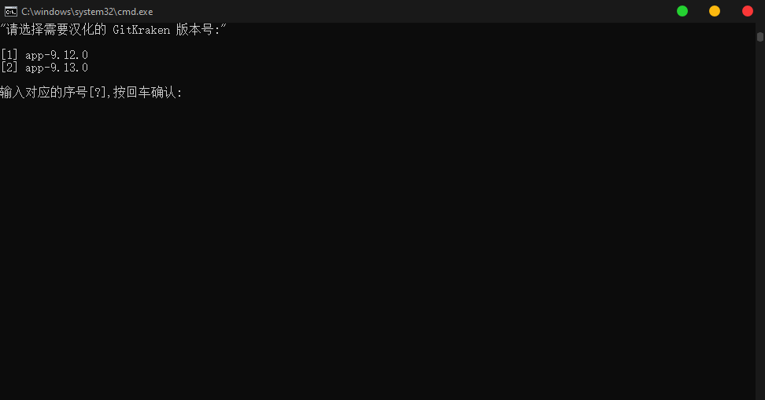
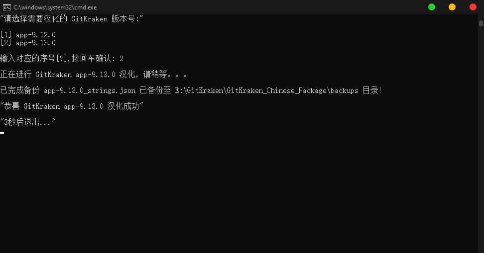
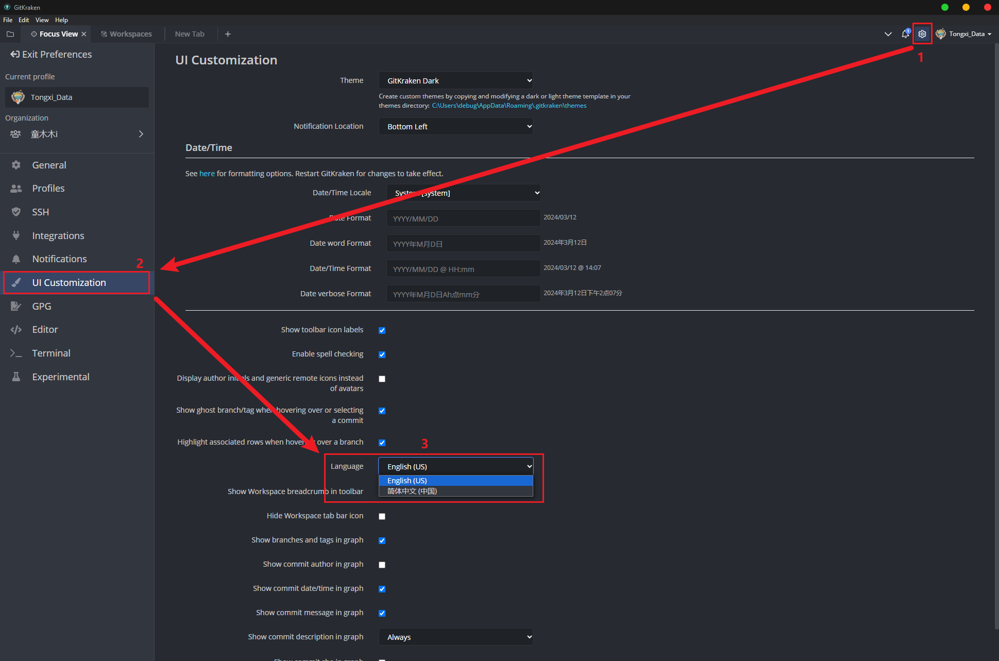

# GitKraken_Chinese_Package

## 1、GitKraken 汉化效果

该项目是将 GitKraken 官方提供的语言包 `strings.json` ，通过 `Chat GPT-4` 自动完成全文的翻译，可能部分翻译内容会存在机器翻译、错误翻译，我已经修正了一部分，大家在使用的过程中遇到有异议的地方，欢迎保存截图评论，我们来共同维护这个 `GitKraken 中文语言包`；

-   工作区界面

-   设置界面

-   菜单栏界面

-   快捷方式界面

## 

## 2、中文语言包配置工具

-   1.下载好资源后，将 ZIP 解压至任意目录，打开 `install.bat` 该批处理可以将对应 `strings.json` 汉化语言包配置到 GitKraken 的安装目录中；

-   2.打开 `install.bat` 批处理会自动检索 GitKraken 的安装目录，同时会将电脑中安装的不同版本显示出来 `如下图所示`，根据提示信息输入对应的序号来选择需要添加语言包的 GitKraken 版本；

-   3.选择 GitKraken 版本后，首先会自动备份 GitKraken 安装目录下的原始语言包 `strings.json` ,会将语言包备份至该项目的资源目录的 `backups` 文件夹中，方便用户后期需要回退、恢复原始语言包；

-   备份完成后，会自动将我们汉化后的中文语言包 `strings.json` 复制到 GitKraken 安装目录下；

-   配置完成后批处理会在 `3秒` 后自动关闭；

-   4.打开对应版本 `GitKraken` 程序，打开设置界面（可以点击主界面右上角的 `齿轮标志`⚙️ 图片 或者 在菜单栏 `Feil -> Preferences -> UI Customization -> language -> 简体中文`），即可将软件设置成中文模式；

-   5.设置成功后 `GitKraken` 会变成全中文;

## 3、致谢

该项目参考了以下三个项目，感谢以下三位作者的贡献：

-   [k-skye/gitkraken-chinese: GitKraken 的中文汉化补丁 (github.com)](https://github.com/k-skye/gitkraken-chinese)
-   [rogeraabbccdd/GitKraken-zh-tw (github.com)](https://github.com/rogeraabbccdd/GitKraken-zh-tw)
-   [Sorkai/GitKraken_Chinese_translate: GitKraken 中文翻译/汉化 (github.com)](https://github.com/Sorkai/GitKraken_Chinese_translate)
